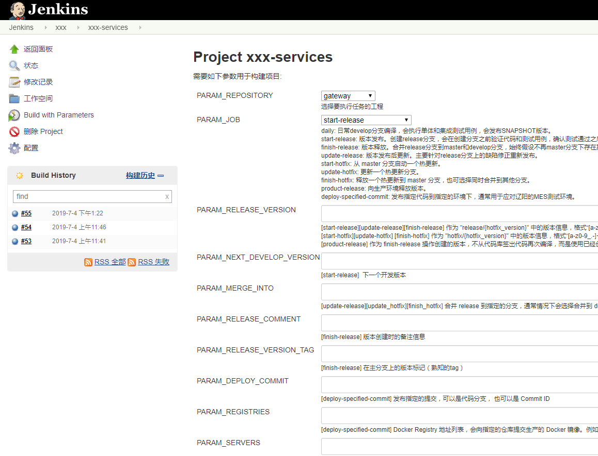

## How to use it.

Fork it, add your steps' scripts into `jobchain/step` folder.

## Step script

The script file name of step should not start with `_`, but you can put your common or useful functions into it.   

For each step script, there is a function named `run` that can accept the parameters defined in the configuration file 
and can return any value which will be temporarily saved for the following steps.

## Configuration

The configuration file format is `YAML`, 
the configuration file contains three parts, separately are `repositories`, `template` and `variable`.

* **repositories**   
It contains repositories, each repository contains jobs, each job contains ordered steps.  
This is an example:
  ```yaml
  repositories:
    bamboo-framework:
      daily:
        checkout:
        maven:
          deploy_repository: ->
          releaseRspository::default::
          http://${nexus_user}:${nexus_password}
          @192.168.1.20:8080/nexus/content/repositories/snapshots
      start-release:
        checkout:
        start_release:
      update-release:
        checkout:
          branch: release/${release_version}
        update_release:
      finish-release:
        checkout:
        finish_release:
  ```
  **NOTE**
  * In the above example, defined a repository named `bamboo-framework`, and four jobs under it, separately named `daily`,
  `start-release`, `update-release` and `finish-release`, each job contains ordered steps.  
  * About the step, its name is the same as the step script file name but without the extension, and the parameters are 
  defined under it.  
  * In some cases, we have to use the same step more than once in a job, so allowed give the step a alias name to 
  identify it. For example, the step `checkout` with a alias name `web` can be defined in format `checkout.web`.

* **template**  
Since allowed define multiple repositories and jobs, they will share the step definitions, if we already defined the 
step templates we can just reference them with the step name.  
In `repositories` section, if you reference a step (with alias) which has been defined in `template` section, will 
inherit the parameters and allowed you override them. 

* **variable**  
Allow define the variables that can be shared in steps, also you can override them by pass the command arguments with 
`-e` option.   
For each variable, contains two options, separately are `parser` and `value`.
    * **parser**  
     It's a function expression or a string contains a function expression(with force convert the return value of the 
     function into a string). It allowed placing the value into the expression with the placeholder `{}`.  
     For example: `$split({});` will parse the input value into an array; `$split({}); in a string` will pass the input 
     value into the function `split`, then convert its return value into a string, finally, will insert the return value
     into the function expression position.  
     Or even more complex, `$eval({}[:-7] if {}.endswith('-plugin') else {});`, do you know what does it meaning?
     * **value**  
     It can be a variable expression or a valid object defined as YAML format. Will not use the predefined value in YAML
     if passed the same variable from the command.

### Variable expression

There are three types of variable expressions, separately are internal variable, variable and function expressions.

* **internal variable**  
  _Format_: `'\$\{((\d+)?(?:\.(?:\w+|\[[\w\.]+\]))*)\}'`  
  _Explain_: `${stepIndex.keys}`  
  _Example_: `${0.context.repository}`, `${3.[172.16.9.52].images}`  
  The index `0` is using for global variables, and the step-index is starting from `1`. If step-index is missing means scoped/local variables.  
  Will show an example to explain how to use the step variables.
  ```yaml
  repositories:
    bamboo-framework:
      daily:
        checkout:
        maven:
          repository: ${1.directory}
        docker_build:
          jar: ${2.auth-service.path}
  ```
  In the above example, the first step is `checkout`, this step will return a dict contains a key `directory` to represent the full directory path of the checked out repository, can pass it into step `maven` by reference it with an expression `${1.directory}`. The step `docker_build` accept an argument `jar`, its value is referencing to the return value of the step `maven`.  
  About Scope/Local variable, its lifecycle is limited in step, for example, can reference an error message in event handler with an expression `${.error.message}`.  
  Predefined global variables  
  
  | Variable Name           | Description     |
  | ---                     | ---             |
  | ${0.context.repository} | Repository Name |
  | ${0.context.job}        | Job Name        |

* **variable**  
  _Format_: `\${([a-zA-Z][\w\-_]+)}`  
  _Explain_: `${variable_name}`  
  _Example_: `${release_version}`  
  This kind of expressions is for reference to the environment variables which accepted from the command line.

* **function**  
  _Format_: `\$([a-zA-Z_]+)\((.*)\);`  
  _Explain_: `$function_name(...arguments);`  
  _Example_: `$split('192.168.12.40 192.168.12.41   192.168.12.42');`  
  Also allowed define the custom functions for different purposes, the function scripts are placed into folder `function`.  
  Only a builtin function named `eval` not placed into folder `function`, can use it to execute a snippet of python script.
  For example: `$eval({}[:-7] if {}.endswith('-plugin') else {});`

## Event handler

It allowed defining event handlers in global, repository, job and step scopes.

Now only support two event types, they are `success` and `error`, the event handler format is `_on_${event_name}`, thus for `success` event handler is named as `_on_success`.

The event handler only accepts two arguments, separately are `name` and `args`, `name` is the same as the file name of event handler script but without the extension, `args` is for event handler arguments.

The event handler search path is from inner to outside, that is `step`, `job`, `reposiotry` and `repositories`.

To access the error object, can use the scoped/local variable expression, the error objects are defined in [jobchain/exception/_\_init__.py](jobchain/exception/__init__.py).

## Installation

```bash
pip install https://github.com/zhangyanwei/job-chain/archive/master.zip
```

## Command line

```bash
python -m jobchain -h
```

## Snapshots

### Jenkins



### Jenkins scripts

```bash
set -Ee
set +x

# if this server restarted, the following line can be removed.
# source /etc/profile

# devops script address and configuration file.
DEVOPS_SCRIPT_URL="http://192.168.1.2:3000/devops/devops-scripts/archive/develop.tar.gz"
DEVOPS_CONFIG_URL="http://192.168.1.2:3000/devops/devops-confs/raw/develop/jenkins/xxx-services.yaml"

# default parameters
PARAM_DINGDING_TOKEN="xxxxxxx"
PARAM_SONAR_HOST="http://192.168.1.2:9000"
PARAM_SONAR_AUTH_TOKEN="xxxxxx"
PARAM_BUILD_ICON_FAIL="http://192.168.1.2:8099/jenkins/static/20cbeeb5/images/48x48/red.png"

# given parameters (提取环境变量)
ENV="-e build_display_name="${BUILD_DISPLAY_NAME}" -e dingding_token=${PARAM_DINGDING_TOKEN} -e build_icon_fail=${PARAM_BUILD_ICON_FAIL} -e build_url=${BUILD_URL}"
[[ -n ${PARAM_REPOSITORY} ]] && ENV="${ENV} -e repository=${PARAM_REPOSITORY}"
[[ -n ${PARAM_SONAR_HOST} ]] && ENV="${ENV} -e sonar_url=${PARAM_SONAR_HOST}"
[[ -n ${PARAM_SONAR_AUTH_TOKEN} ]] && ENV="${ENV} -e sonar_auth_token=${PARAM_SONAR_AUTH_TOKEN}"
[[ -n ${PARAM_SKIP_UNIT_TEST} ]] && ENV="${ENV} -e skip_unit_test=${PARAM_SKIP_UNIT_TEST}"
[[ -n ${PARAM_SKIP_IT_TEST} ]] && ENV="${ENV} -e skip_it_test=${PARAM_SKIP_IT_TEST}"
[[ -n ${PARAM_RELEASE_VERSION} ]] && ENV="${ENV} -e release_version=${PARAM_RELEASE_VERSION} -e hotfix_version=${PARAM_RELEASE_VERSION}"
[[ -n ${PARAM_RELEASE_COMMENT} ]] && ENV="${ENV} -e release_comment=\"$(sed "s/\"/\\\\\"/g" <<< ${PARAM_RELEASE_COMMENT})\""
[[ -n ${PARAM_RELEASE_VERSION_TAG} ]] && ENV="${ENV} -e release_tag=${PARAM_RELEASE_VERSION_TAG}"
[[ -n ${PARAM_NEXT_DEVELOP_VERSION} ]] && ENV="${ENV} -e next_develop_version=${PARAM_NEXT_DEVELOP_VERSION}"
[[ -n ${PARAM_MERGE_INTO} ]] && ENV="${ENV} -e merge_into=${PARAM_MERGE_INTO}"
[[ -n ${PARAM_DEPLOY_COMMIT} ]] && ENV="${ENV} -e deploy_commit=${PARAM_DEPLOY_COMMIT}"
[[ -n ${PARAM_REGISTRIES} ]] && ENV="${ENV} -e registries=${PARAM_REGISTRIES}"
[[ -n ${PARAM_SERVERS} ]] && ENV="${ENV} -e servers=${PARAM_SERVERS}"

if [[ -n $PARAM_ENV ]]; then
    ENV=${ENV} $(
python3 << EOF
import re

combined = " ".join([f"-e {key}={value}" for key, value in re.findall(r'\s*([^= ]+)=(".*?(?<!\\\\)"|[^" ]*)', '${PARAM_ENV}')])
print(combined)
EOF
)
fi

# Python 可执行文件
export PYTHON_EXECUTABLE=python3

# 直接从git仓库中下载最新的脚本
pip3 install -U ${DEVOPS_SCRIPT_URL} -i https://mirrors.aliyun.com/pypi/simple

# 执行脚本，并附带参数
cmd="${PYTHON_EXECUTABLE} -m jobchain -f ${DEVOPS_CONFIG_URL} -r xxx-services -j ${PARAM_JOB} --maven-executor \"/home/maven/bin/mvn {}\" ${ENV}"

echo "the command is: ${cmd}"
eval ${cmd}
```
